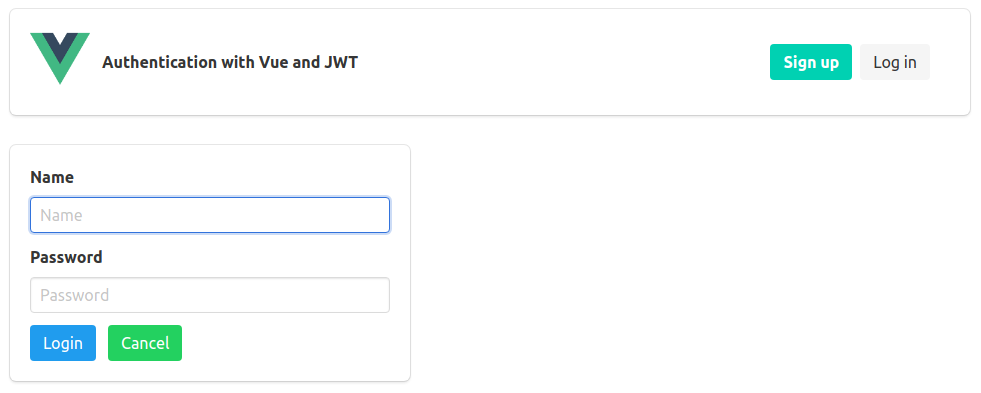

# Auth-JWT

<p align='center'></p>

### Setup
```
> yarn install
```

### API
```
> cd auth-jwt/api
> node index.js
Server listening at http://localhost:4567
```

### Auth-JWT
```
> cd auth-jwt
> yarn serve
App running at:
- Local: http://localhost:8080/
```
